# Zero Downtime Deployments Lab

This Zero Downtime Deployments (ZDD) lab aims at providing an introduction to [DC/OS](https://dcos.io/) service deployments.
It serves as a step-wise guide how to deploy new versions of a DC/OS service without causing downtimes.

We will do the following in the ZDD lab:

1. A rolling upgrade using the [default behaviour](#default-behaviour)
  1. [Without health checks](#without-health-checks)
  1. [With health checks](#with-health-checks)
  1. [With readiness checks](#with-readiness-checks)
1. A rolling upgrade with [minimal overcapacity](#minimal-overcapacity)
1. A [canary deployment](#canary-deployment)
1. A [Blue-Green deployment](#blue-green-deployment)

## Preparation

Throughout the ZDD lab we will be using [simpleservice](https://github.com/mhausenblas/simpleservice), a
simple test service, allowing us to simulate certain behaviour such as reporting a certain version and health check delays.

If you want to follow along and try out the described steps yourself, here are the prerequisites:

- A running [DC/OS 1.8](https://dcos.io/releases/1.8.4/) cluster with at least one private agent, see also [installation](https://dcos.io/install/) if you don't have one yet.
- The [DC/OS CLI](https://dcos.io/docs/1.8/usage/cli/) installed and configured. 
- The [jq](https://stedolan.github.io/jq/) tool, command-line JSON processor, installed.

Finally, as a preparation you should have a (quick) look at the following docs (in the order we are using it in the ZDD lab):

- [health checks](https://mesosphere.github.io/marathon/docs/health-checks.html)
- [deployments](https://mesosphere.github.io/marathon/docs/deployments.html)
- [readiness checks](https://mesosphere.github.io/marathon/docs/readiness-checks.html) (OPTIONAL)
- [load balancing with HAProxy](https://serversforhackers.com/load-balancing-with-haproxy) (OPTIONAL)
- [Marathon Blue-Green deployments](https://mesosphere.github.io/marathon/docs/blue-green-deploy.html)
- [Marathon-LB ZDD](https://github.com/mesosphere/marathon-lb#zero-downtime-deployments)

## Default behaviour

The default behaviour of DC/OS service deployments is a rolling upgrade, that is, DC/OS launches instances of the
new version of your service while shutting down (killing) instances with the old version. How exactly this takes place
depends on how much information (about the status of your service) you provide to DC/OS. This status info is called health 
and readiness checks in DC/OS and in the following we will walk through each of the basic cases.

### Without health checks

To explore the default deployment behaviour of DC/OS services we're using [base.json](default/base.json).
This launches a service with the ID `/zdd/base` with 4 instances of `simpleservice`, without health checking, and initially in the version `0.9`:

    $ dcos marathon app add default/base.json

Now we should be able to verify that `simpleservice` is running and there are indeed 4 instances (tasks) available:

    $ dcos marathon task list /zdd/base
    APP        HEALTHY          STARTED              HOST     ID
    /zdd/base    True   2016-10-12T11:38:56.845Z  10.0.3.192  zdd_base.75440e42-9070-11e6-aae4-3a4b79075094
    /zdd/base    True   2016-10-12T11:38:56.861Z  10.0.3.193  zdd_base.75443553-9070-11e6-aae4-3a4b79075094
    /zdd/base    True   2016-10-12T11:38:56.878Z  10.0.3.193  zdd_base.754546c5-9070-11e6-aae4-3a4b79075094
    /zdd/base    True   2016-10-12T11:38:56.884Z  10.0.3.192  zdd_base.7544f8a4-9070-11e6-aae4-3a4b79075094

The last column in above output is the so called `task ID` which we will be using in the following to refer to a single instance of `simpleservice`.

Next, let's see what version of `simpleservice` is running. For this we need to invoke one of the 4 instances of `simpleservice`, so we pick a random one and try to discover where it is available:

    $ dcos marathon task show zdd_base.75443553-9070-11e6-aae4-3a4b79075094
    {
      "appId": "/zdd/base",
      "host": "10.0.3.193",
      "id": "zdd_base.75443553-9070-11e6-aae4-3a4b79075094",
      "ipAddresses": [
        {
          "ipAddress": "10.0.3.193",
          "protocol": "IPv4"
        }
      ],
      "ports": [
        1765
      ],
      "servicePorts": [
        10000
      ],
      "slaveId": "145f052d-8bcb-457f-b1e6-b1b4e2cdf787-S1",
      "stagedAt": "2016-10-12T11:38:55.952Z",
      "startedAt": "2016-10-12T11:38:56.861Z",
      "state": "TASK_RUNNING",
      "version": "2016-10-12T11:38:55.934Z"
    }

From the above output we learn that the instance `zdd_base.75443553-9070-11e6-aae4-3a4b79075094` of `simpleservice` is available via `10.0.3.193:1765`. Since we didn't deploy the `simpleservice` onto a public agent, it is only available and accessible from with the cluster. We hence ssh into the DC/OS cluster to invoke the previously mentioned instance, for example like so:

    $ ssh -A core@$MASTER_IP_ADDRESS
    CoreOS stable (1068.9.0)
    Last login: Wed Oct 12 10:39:38 2016 from 46.7.174.29
    Update Strategy: No Reboots
    Failed Units: 1
      update-engine.service
    core@ip-10-0-6-211 ~ $ curl 10.0.3.193:1765/endpoint0
    {"host": "10.0.3.193:1765", "version": "0.9", "result": "all is well"}

So we see from above output that indeed all is well and `simpleservice` is serving in version `0.9`. At the same time, we can have a look at the logs of this instance to verify that it has been invoked (in a new terminal):

    $ dcos task log --follow zdd_base.75443553-9070-11e6-aae4-3a4b79075094 stderr
    I1012 11:38:56.152595 27678 docker.cpp:815] Running docker -H unix:///var/run/docker.sock run --cpu-shares 102 --memory 33554432 -e MARATHON_APP_VERSION=2016-10-12T11:38:55.934Z -e HOST=10.0.3.193 -e MARATHON_APP_RESOURCE_CPUS=0.1 -e SIMPLE_SERVICE_VERSION=0.9 -e MARATHON_APP_RESOURCE_GPUS=0 -e HEALTH_MAX=5000 -e MARATHON_APP_DOCKER_IMAGE=mhausenblas/simpleservice:0.4.0 -e PORT_10000=1765 -e MESOS_TASK_ID=zdd_base.75443553-9070-11e6-aae4-3a4b79075094 -e PORT=1765 -e MARATHON_APP_RESOURCE_MEM=32.0 -e PORTS=1765 -e MARATHON_APP_RESOURCE_DISK=0.0 -e HEALTH_MIN=1000 -e MARATHON_APP_LABELS= -e MARATHON_APP_ID=/zdd/base -e PORT0=1765 -e LIBPROCESS_IP=10.0.3.193 -e MESOS_SANDBOX=/mnt/mesos/sandbox -e MESOS_CONTAINER_NAME=mesos-145f052d-8bcb-457f-b1e6-b1b4e2cdf787-S1.76d75960-dd4d-49c1-b320-b8f466353927 -v /var/lib/mesos/slave/slaves/145f052d-8bcb-457f-b1e6-b1b4e2cdf787-S1/frameworks/145f052d-8bcb-457f-b1e6-b1b4e2cdf787-0000/executors/zdd_base.75443553-9070-11e6-aae4-3a4b79075094/runs/76d75960-dd4d-49c1-b320-b8f466353927:/mnt/mesos/sandbox --net host --name mesos-145f052d-8bcb-457f-b1e6-b1b4e2cdf787-S1.76d75960-dd4d-49c1-b320-b8f466353927 mhausenblas/simpleservice:0.4.0
    2016-10-12T11:38:56 INFO This is simple service in version v0.9 listening on port 1765 [at line 101]
    2016-10-12T12:00:36 INFO /endpoint0 serving from 10.0.3.193:1765 has been invoked from 10.0.6.211 [at line 59]
    2016-10-12T12:00:36 INFO 200 GET /endpoint0 (10.0.6.211) 1.04ms [at line 1946]

Now, we update the version of `simpleservice` by changing `SIMPLE_SERVICE_VERSION` to `1.0`, either through locally editing `base.json` and using the CLI command `dcos marathon app update /zdd/base < default/base.json` or via the DC/OS UI as shown in the following:

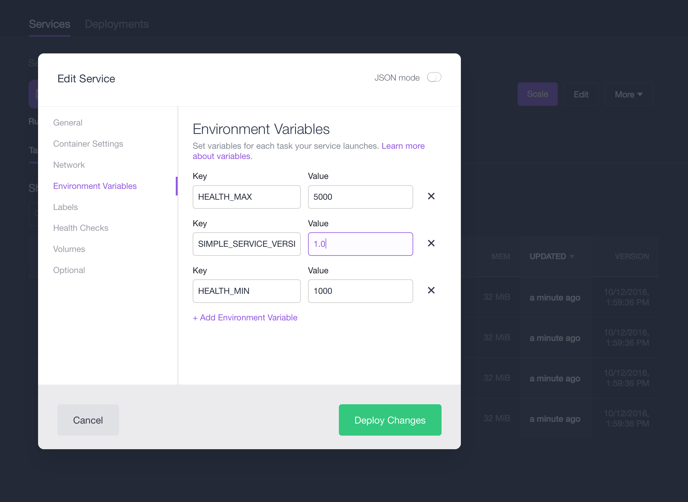

Once you hit the `Deploy Changes` button you should see something like the following:

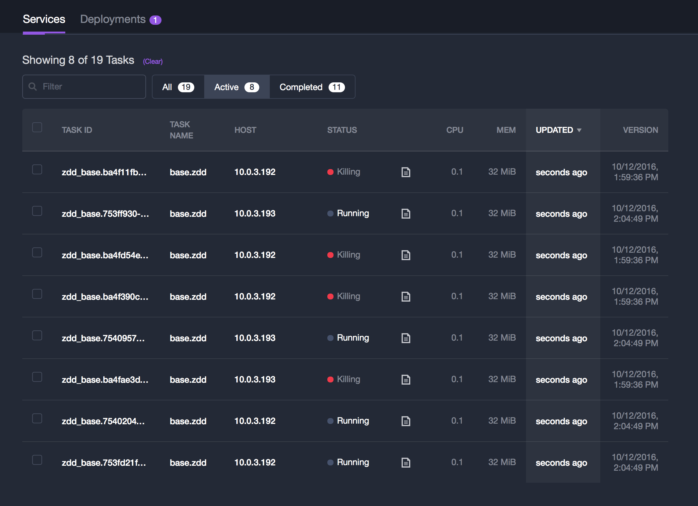

Notice the old (`0.9`) instances being killed and the new (`1.0`) ones running, overall we have 8 tasks active. To verify if the new version is available we again (from within the cluster) invoke one of the instances as shown previously:

    core@ip-10-0-6-211 ~ $ curl 10.0.3.193:27670/endpoint0
    {"host": "10.0.3.193:27670", "version": "1.0", "result": "all is well"}

Also, notice that none of the instances in the DC/OS UI is showing healthy. This is because DC/OS doesn't know anything about the health status. Let's change that.

Note also that if you only want to scale the app (keeping the same version) you can use the following CLI command: `dcos marathon app update /zdd/base instances=5` to scale to 5 instances.

### With health checks

To explore the default deployment behaviour of DC/OS services with health checks, we're using [base-health.json](default/base-health.json).
This launches a service with the ID `/zdd/base-health` with 4 instances of `simpleservice`, with health checking, and initially in the version `0.9`:

    $ dcos marathon app add default/base-health.json

What we now see in the DC/OS UI is the following:

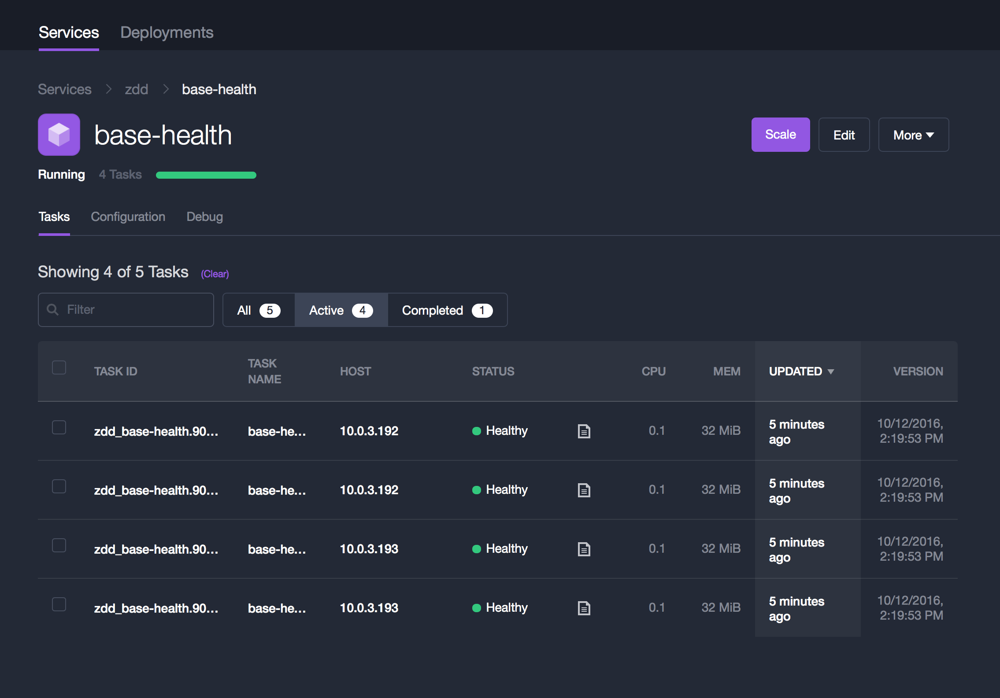

And indeed, as expected, DC/OS can now tell that all instances are healthy, thanks to the following snippet in `base-health.json` (note that besides `path` all other fields are actually the default values):

    "healthChecks": [{
        "protocol": "HTTP",
        "path": "/health",
        "gracePeriodSeconds": 300,
        "intervalSeconds": 60,
        "timeoutSeconds": 20,
        "maxConsecutiveFailures": 3,
        "ignoreHttp1xx": false
    }]

Alternatively, you can check the health of the `/zdd/base-health` service using the DC/OS CLI and `jq` like so:

    $ dcos marathon app show /zdd/base-health | jq '.tasks[].healthCheckResults[]'
    {
      "alive": true,
      "consecutiveFailures": 0,
      "firstSuccess": "2016-10-12T13:20:03.005Z",
      "lastFailure": null,
      "lastFailureCause": null,
      "lastSuccess": "2016-10-12T13:27:01.323Z",
      "taskId": "zdd_base-health.90056376-907e-11e6-aae4-3a4b79075094"
    }
    {
      "alive": true,
      "consecutiveFailures": 0,
      "firstSuccess": "2016-10-12T13:20:03.434Z",
      "lastFailure": null,
      "lastFailureCause": null,
      "lastSuccess": "2016-10-12T13:27:01.795Z",
      "taskId": "zdd_base-health.90056377-907e-11e6-aae4-3a4b79075094"
    }
    {
      "alive": true,
      "consecutiveFailures": 0,
      "firstSuccess": "2016-10-12T13:20:03.602Z",
      "lastFailure": null,
      "lastFailureCause": null,
      "lastSuccess": "2016-10-12T13:27:00.691Z",
      "taskId": "zdd_base-health.9004a024-907e-11e6-aae4-3a4b79075094"
    }
    {
      "alive": true,
      "consecutiveFailures": 0,
      "firstSuccess": "2016-10-12T13:20:00.989Z",
      "lastFailure": null,
      "lastFailureCause": null,
      "lastSuccess": "2016-10-12T13:27:02.398Z",
      "taskId": "zdd_base-health.9004c735-907e-11e6-aae4-3a4b79075094"
    }

And, of course, as in the first case without health checks we can use `dcos marathon task list /zdd/base-health` to explore the 4 instances and verify if they serve the right version (`0.9`). Note, however, that in contrast to the previous case, the tasks now have a `healthCheckResults` array which provides you with details on what is going on concerning the health checks DC/OS performs.

Let's now simulate a case where the health checks fail (time out), for example, because of an internal service failure or an integration point not being available. For this, we need to change two things: the `healthChecks` in `base-health.json` (either locally + CLI command `dcos marathon app update /zdd/base-health < default/base-health.json` or via the DC/OS UI) and as well as the `HEALTH_MIN`, `HEALTH_MAX`, and `SIMPLE_SERVICE_VERSION` env variables, resulting in:

    {
      "id": "/zdd/base-health",
      "instances": 4,
      "cpus": 0.1,
      "mem": 32,
      "container": {
        "type": "DOCKER",
        "docker": {
          "image": "mhausenblas/simpleservice:0.4.0",
          "network": "HOST"
        }
      },
      "env": {
        "HEALTH_MIN": "1000",
        "HEALTH_MAX": "5000",
        "SIMPLE_SERVICE_VERSION": "1.0"
      },
      "healthChecks": [{
        "protocol": "HTTP",
        "path": "/health",
        "gracePeriodSeconds": 300,
        "intervalSeconds": 30,
        "timeoutSeconds": 4,
        "maxConsecutiveFailures": 20,
        "ignoreHttp1xx": false
      }]
    }

Note that we've changed `timeoutSeconds` to `4`, meaning that if it takes longer than 4 sec for the `/health` endpoint to respond with `200` the instance is considered unhealthy. Since `HEALTH_MIN` is set to `1000` there should be at least one instance randomly assigned with a delay below 4 sec and hence we expect at least one unhealthy task. If you see all healthy, repeat the deployment or change the values so that it's more likely to happen. 

Further, note that we changed `SIMPLE_SERVICE_VERSION` to `1.0`, hence rolling out a new version, as well as increased `maxConsecutiveFailures` to `20` to give DC/OS enough opportunities to launch healthy instances and finally decreased `intervalSeconds` to `30` to perform the checks faster.

Once the deployment has been kicked off, you should see a sequence like the following (note that the actual sequence will differ, depending on how many instances have been randomly assigned time outs above the 4 sec threshold and hence are not considered not healthy by DC/OS):

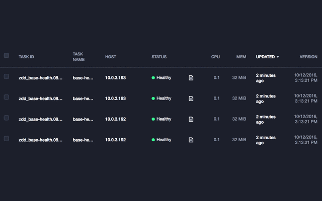

[STEP 0](img/base-health-update-deployment-step0.png) | [STEP 1](img/base-health-update-deployment-step1.png) | [STEP 2](img/base-health-update-deployment-step2.png) | [STEP 3](img/base-health-update-deployment-step3.png) | [STEP 4](img/base-health-update-deployment-step4.png)

Now, what happened? We requested 4 running, healthy instances of `simpleservice`. DC/OS recognizes the unhealthy instances and re-starts them until it has achieved the goal.

### With readiness checks

So far we've been focusing on `healthChecks`, which are typically used to periodically check the health of a running service. In the deployment phase, for example, in the initial deployment or when you do a rolling upgrade via `dcos marathon app update`, there may be the need to realize when a service is ready to serve traffic. This could be the case for stateful services (a database) or if there are integration points calling out to 3rd party services such as AWS S3 or Azure Event Bus. The difference between `healthChecks` and `readinessChecks` is essentially that if a health check for a task fails, DC/OS will replace that task, whereas in the case of the readiness check failing DC/OS will wait until it succeeds before continuing with the deployment.

To use a `readinessChecks` use something like shown in [base-ready.json](default/base-ready.json) (note that you MUST specify a `portDefinitions` in the spec and give it a name that you then reference in `portName`, otherwise it will not work):

    $ dcos marathon app add default/base-ready.json
    $ dcos marathon app show /zdd/base-ready | jq '.readinessChecks'
    [
      {
        "httpStatusCodesForReady": [
          200
        ],
        "intervalSeconds": 30,
        "name": "readinessCheck",
        "path": "/health",
        "portName": "main-api",
        "preserveLastResponse": false,
        "protocol": "HTTP",
        "timeoutSeconds": 10
      }
    ]

Note that `readinessChecks` result is a global property of the service (not on a task level). Note also that it's orthogonal to the `healthChecks`, that is, `dcos marathon app show /zdd/base-ready | jq '.tasks[].healthCheckResults[]'` will return an empty result and also the DC/OS UI will only show the tasks `Running` and not `Healthy`.

Recommendation: use this property only if you really need fine-grained control over the deployment process, for example, in the context of a framework scheduler.

## Minimal overcapacity

Using the defaults (as described in the section [default behaviour](#default-behaviour)) the DC/OS service deployments have the following implicit settings:

    "upgradeStrategy": {
      "minimumHealthCapacity": 1.0,
      "maximumOverCapacity": 1.0
    }

In other words, the defaults of the [upgrade strategy](https://mesosphere.github.io/marathon/docs/rest-api.html#upgrade-strategy) mean that it results in a rather safe but somewhat resource-intensive upgrade.

Formally, the meaning of `minimumHealthCapacity`  and `maximumOverCapacity` is as follows:

- `minimumHealthCapacity` …  a floating point value between 0 and 1 (which defaults to `1`), specifying the % of instances to maintain healthy during deployment; with `0` meaning all old instances are stopped before the new version is deployed and `1` meaning all instances of the new version are deployed side by side with the old one before it is stopped.
- `maximumOverCapacity` …  a floating point value between 0 and 1 (which defaults to `1`), specifying the max. % of instances over capacity during deployment; with `0` meaning that during the upgrade process no additional capacity than may be used for old and new instances ( only when an old version is stopped, a new instance can be deployed) and  `1` meaning that all old and new instances can co-exist during the upgrade process.

Now, it's not always the case that there are sufficient spare capacities in the DC/OS cluster available. To carry out a deployment that uses minimal overcapacity, we could do the following:

    {
      "id": "/zdd/base-min-over",
      "instances": 4,
      "cpus": 0.1,
      "mem": 32,
      "container": {
        "type": "DOCKER",
        "docker": {
          "image": "mhausenblas/simpleservice:0.4.0",
          "network": "HOST"
        }
      },
      "env": {
        "HEALTH_MIN": "1000",
        "HEALTH_MAX": "5000",
        "SIMPLE_SERVICE_VERSION": "0.9"
      },
      "healthChecks": [{
        "protocol": "HTTP",
        "path": "/health",
        "gracePeriodSeconds": 300,
        "intervalSeconds": 60,
        "timeoutSeconds": 20,
        "maxConsecutiveFailures": 3,
        "ignoreHttp1xx": false
      }],
      "upgradeStrategy": {
        "minimumHealthCapacity": 0.25,
        "maximumOverCapacity": 0.25
      }
    }

In above example, notice the `"minimumHealthCapacity": 0.25` and `"maximumOverCapacity": 0.25`. 
Let's now have a look at how this might play out, step-by-step, when we simulate the upgrade to 
version `1.0` by changing `SIMPLE_SERVICE_VERSION` to `1.0`:

```
T0:    [0.9] [0.9] [0.9] [0.9]      
                                    
T1:    deployment kicks off         
                                    
T2:    [0.9] [0.9] [0.9] [0.9] [1.0]
                         |          
T3:    [0.9] [0.9] [0.9] [1.0] [1.0]
                   |                
T4:    [0.9] [0.9] [1.0] [1.0] [1.0]
             |                      
T5:    [0.9] [1.0] [1.0] [1.0] [1.0]
        |                           
T6:    [1.0] [1.0] [1.0] [1.0]      
                                    
T7:    deployment done              
```

A `minimumHealthCapacity` of `0.25` means that 25% or exactly one instance (in our case, since we have specified 4) always needs to run on a certain version. I other words, at no time in the deployment can the app have less than one instance running with any given version, say, `0.9`. 

Up to and incl. timepoint `T0` the current version of the app was `0.9`. When the deployment kicks off at timepoint `T1` the `maximumOverCapacity` attribute becomes important: since we've set it to `0.25`  it means no more than 25% (or: exactly one instance in our case) can be run in addition to the already running instances. In other words: with this setting, no more than 5 instances of the app (in whatever version they might be in) can ever run at the same time.

At `T2` one instance at version `1.0` comes up, satisfying both capacity requirements; in the DC/OS UI this would, for example, look something like the following (note that when you look at the right-most `VERSION` column you see 4 instances with `10/13/2016, 1:36:22 PM` which corresponds to the `0.9` service version and 1 instance with `10/13/2016, 1:36:48 PM`, corresponding to `1.0`):

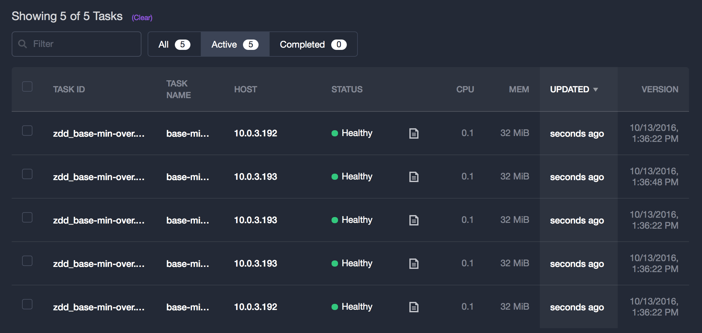

At `T3`, one `0.9` instance is stopped and replaced by a `1.0` instance; at `T4` the same happens again and with the `T5-T6` transition the last remaining `0.9` instance is stopped and since we now have 4 instances of `1.0` running all is good and as expected at `T7`.

Lesson learned: certain combinations of `minimumHealthCapacity` and `maximumOverCapacity` make sense while others are not satisfiable, meaning that you can specify them, just the deployment will never be carried out. For example, a `"minimumHealthCapacity": 0.5` and `"maximumOverCapacity": 0.1` would be unsatisfiable, since you want to keep at least half of your instances around but only allow 10% overcapacity. To make this latter deployment satisfiable you'd need to change it to `"maximumOverCapacity": 0.5`.

Tip: If you want to see the exact sequence of events happening, use the [Event Bus](https://mesosphere.github.io/marathon/docs/event-bus.html), like so (note that this is executed from within the DC/OS cluster):

    $ curl -H "Accept: text/event-stream" leader.mesos:8080/v2/events 
    event: event_stream_attached
    data: {"remoteAddress":"10.0.6.211","eventType":"event_stream_attached","timestamp":"2016-10-13T13:29:08.959Z"}

A recording of an example session for the above case (`/zdd/base-min-over`) is available here: [event-bus-log-base-min-over.txt](event-bus-log-base-min-over.txt).

## Canary deployment

The deployments discussed so far all allowed us to do rolling upgrades of a service without causing any downtimes. That is, at any point in time, clients of the `simpleservice` would be served with some version of the service. However, there is one drawback with the deployments so far: clients of the service will potentially see different versions during the deployment in an uncontrolled manner until the point in time all new instances of the service would turn healthy.

In a more realistic setup one would use a load balancer in front of the service instances: on the one hand, this would more evenly distribute the load amongst the service instances and on the other hand it allows us to carry out more advanced ZDD such as the one we're discussing in the following: a [canary deployment](http://martinfowler.com/bliki/CanaryRelease.html). The basic idea behind it is to expose a small fraction of the clients to a new version of the service. Once you're confident it works as expected you roll out the new version to all users. If you take this a step further, for example, by having multiple versions of the service you can do also A/B testing with it.

We now have a look at a canary deployment with DC/OS: we will have 3 instances serving version `0.9` of `simpleservice` and 1 instance serving version `1.0` and want 80% of the traffic to be served by the former and 20% by the latter, the canary. In addition and in contrast to the previous cases want to expose the service to the outside world. That is, `simpleservice` should not only be available to clients within the DC/OS cluster but publicly available, from the wider Internet. So we aim to end up with the following situation:

    +----------+
    |          |
    |   v0.9   +----+
    |          |    |
    +----------+    |
                    |                 +----------+
    +----------+    |                 |          |
    |          |    |             80% |          |
    |   v0.9   +----------------------+          |
    |          |    |                 |          |
    +----------+    |                 |          |
                    |                 |          | <-------------+ clients
    +----------+    |                 |          |
    |          |    |             20% |          |
    |   v0.9   +----+        +--------+          |
    |          |             |        |          |
    +----------+             |        |          |
                             |        +----------+
    +----------+             |
    |          |             |
    |   v1.0   +-------------+
    |          |
    +----------+

Enter [VAMP](http://vamp.io/). VAMP is a platform for managing containerized microservices, supporting canary releases, route updates, metrics collection and service discovery. Note that while VAMP is conveniently available as a [package in the DC/OS Universe](https://github.com/mesosphere/universe/tree/version-3.x/repo/packages/V/vamp/) we will install a more recent version manually in the following to address a dependencies such as Elasticsearch and Logstash better and have a finer-grained control over how we want to use VAMP.

You can either set up VAMP in an automated fashion, using a [DC/OS Jobs-based installer](https://gist.github.com/mhausenblas/bb967625088902874d631eaa502573cb) or manually, carrying out the following steps:

1. Deploy [vamp-es.json](canary/vamp-es.json)
1. Deploy [vamp.json](canary/vamp.json)
1. Deploy [vamp-gateway.json](canary/vamp-gateway.json) 

Deploy above either via the `dcos marathon app add` command or using the DC/OS UI and note that in `vamp-gateway.json` you need to change the `instances` to the number of agents you have in your cluster (find that out via `dcos node`):

    ...
    "instances": 3,
    ...

Now, head over to `http://$PUBLIC_AGENT:8080`, in my case `http://52.25.126.14:8080/` and you should see:

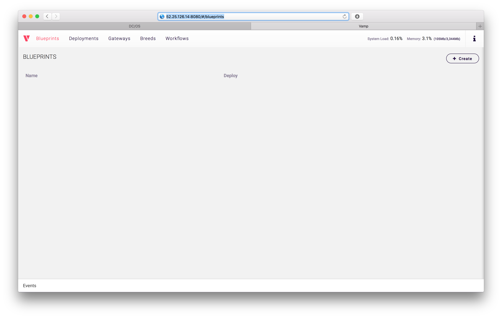

Now you can define a VAMP blueprint (also available via [simpleservice-blueprint.yaml](canary/simpleservice-blueprint.yaml)) by pasting it in the VAMP UI under the `Blueprints` tab and hit `Create` or use the VAMP [HTTP API](http://vamp.io/documentation/api-reference/) to submit it:

    ---
    name: simpleservice
    gateways:
      10099: simpleservice/port
    clusters:
      simpleservice:
       gateways:
          routes:
            simpleservice:0.9:
              weight: 80%
            simpleservice:1.0:
              weight: 20%
       services:
          -
            breed:
              name: simpleservice:0.9
              deployable: mhausenblas/simpleservice:0.4.0
              ports:
                port: 0/http
              env:
                SIMPLE_SERVICE_VERSION: "0.9"
            scale:
              cpu: 0.1
              memory: 32MB
              instances: 3
          -
            breed:
              name: simpleservice:1.0
              deployable: mhausenblas/simpleservice:0.4.0
              ports:
                port: 0/http
              env:
                SIMPLE_SERVICE_VERSION: "1.0"
            scale:
              cpu: 0.1
              memory: 32MB
              instances: 1

To use the above blueprint, hit the `Deploy as` button and you should see the following in the `Deployments` tab:

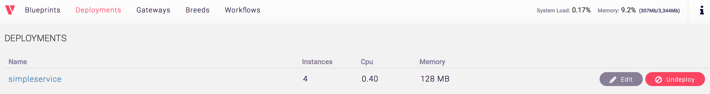

As well as the following under the `Gateways` tab:

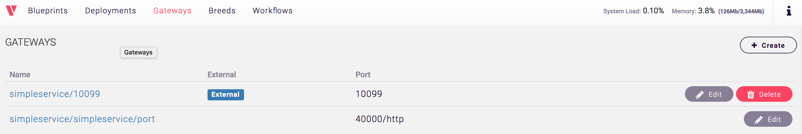

We can now check which version clients of `simpleservice` see, using the [canary-check.sh](canary/canary-check.sh) test script as shown in the following (with the public agent, that is, `http://$PUBLIC_AGENT` as the first argument and the number of clients as the optional second argument, `10` in this case):

    $ ./canary-check.sh http://52.25.126.14 10
    Invoking simpleservice: 0
    Invoking simpleservice: 1
    Invoking simpleservice: 2
    Invoking simpleservice: 3
    Invoking simpleservice: 4
    Invoking simpleservice: 5
    Invoking simpleservice: 6
    Invoking simpleservice: 7
    Invoking simpleservice: 8
    Invoking simpleservice: 9
    Out of 10 clients of simpleservice 8 saw version 0.9 and 2 saw version 1.0

As expected, now 80% of the clients see version `0.9` and 20% are served by version `1.0`.

Tip: If you want to simulate more clients here, pass in the number of clients as the second argument, as in `./canary-check.sh http://52.25.126.14 100` to simulate 100 clients, for example.

With this we conclude the canary deployment section and if you want to learn more, you might also want to check out the [VAMP tutorial on this topic](http://vamp.io/documentation/guides/getting-started-tutorial/2-canary-release/).

## Blue-Green deployment

Another popular form of ZDD supported by DC/OS is the [Blue-Green deployment](http://martinfowler.com/bliki/BlueGreenDeployment.html). Here, the idea is basically to have two versions of your service (unsurprisingly called `blue` and `green`): let's say that `blue` is the live one, serving production traffic and `green` is the new version to be rolled out. Once all instances of `green` are healthy, a load balancer is reconfigured to cut over from `blue` to `green` and if necessary (to roll back) one can do the same in the reverse direction. 

Essentially, we want the following. We start out with `blue` being active: 

    +----------------+
    |                |
    |                |                +----------+
    |   blue (v0.9)  +------+         |          |
    |                |      |         |          |
    |                |      +---------+          |
    +----------------+                |          |
                                      |          |
                                      |          | <-------------+ clients
                                      |          |
    +----------------+                |          |
    |                |                |          |
    |                |                |          |
    |  green (v1.0)  |                |          |
    |                |                +----------+
    |                |
    +----------------+

And once `green` is healthy, we cut over to it by updating the routing:

    +----------------+
    |                |
    |                |                +----------+
    |   blue (v0.9)  |                |          |
    |                |                |          |
    |                |                |          |
    +----------------+                |          |
                                      |          |
                                      |          | <-------------+ clients
                                      |          |
    +----------------+                |          |
    |                |      +---------+          |
    |                |      |         |          |
    |  green (v1.0)  +------+         |          |
    |                |                +----------+
    |                |
    +----------------+

As a first step, we need a load balancer. For this we install [Marathon-LB](https://dcos.io/docs/1.8/usage/service-discovery/marathon-lb/) (MLB for short) from the Universe:

    $ dcos package install marathon-lb
    We recommend a minimum of 0.5 CPUs and 256 MB of RAM available for the Marathon-LB DCOS Service.
    Continue installing? [yes/no] yes
    Installing Marathon app for package [marathon-lb] version [1.4.1]
    Marathon-lb DC/OS Service has been successfully installed!
    See https://github.com/mesosphere/marathon-lb for documentation.

In its default configuration, just as we did with the `dcos package install` command above, MLB runs on a public agent, acting as an edge router and allows us to expose a DC/OS service to the outside world. The MLB default config looks like the following:

    {
      "marathon-lb": {
        "auto-assign-service-ports": false,
        "bind-http-https": true,
        "cpus": 2,
        "haproxy-group": "external",
        "haproxy-map": true,
        "instances": 1,
        "mem": 1024,
        "minimumHealthCapacity": 0.5,
        "maximumOverCapacity": 0.2,
        "name": "marathon-lb",
        "role": "slave_public",
        "sysctl-params": "net.ipv4.tcp_tw_reuse=1 net.ipv4.tcp_fin_timeout=30 net.ipv4.tcp_max_syn_backlog=10240 net.ipv4.tcp_max_tw_buckets=400000 net.ipv4.tcp_max_orphans=60000 net.core.somaxconn=10000",
        "marathon-uri": "http://master.mesos:8080"
      }
    }

MLB is using [HAProxy](http://www.haproxy.org/) under the hood and gets the information it needs to re-write the mappings from frontends to backends from the Marathon event bus. Once MLB is installed, you need to [locate the public agent](https://dcos.io/docs/1.8/administration/locate-public-agent/) it runs on, let's say `$PUBLIC_AGENT` is the resulting IP. Now, to see the HAProxy MLB has under management in action, visit the URL `http://$PUBLIC_AGENT:9090/haproxy?stats` and you should see something like the following:

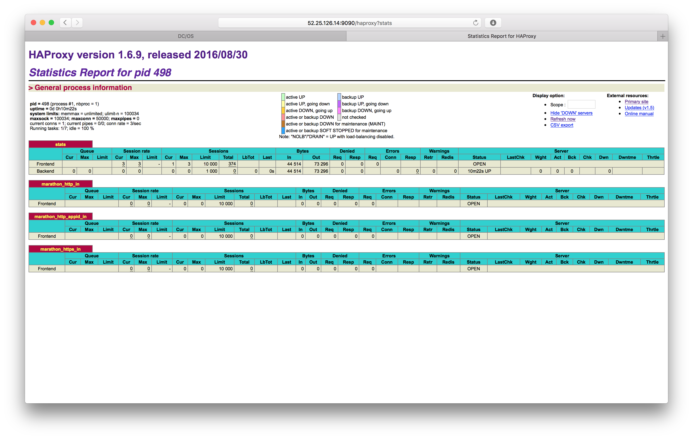

In the following we will walk through a manual sequence how to achieve the Blue-Green deployment, however in practice an automated approach is recommended (and pointed out at the end of this section).

So, let's dive into it. First we set up the `blue` version of `simpleservice` via MLB we're using [blue.json](blue-green/blue.json). In the following is the new section highlighted that has been added to `base-health.json` to make this happen:

    "labels": {
      "HAPROXY_GROUP": "external"
      "HAPROXY_0_PORT": "10080",
      "HAPROXY_0_VHOST": "http://ec2-52-25-126-14.us-west-2.compute.amazonaws.com"
    }

The semantics of the added labels from above is as follows:

- `HAPROXY_GROUP` is set to expose it on the (edge-routing) MLB we installed in the previous step.
- `HAPROXY_0_PORT` defines`10080` as the external, public port we want version `0.9` of `simpleservice` to be available.
- `HAPROXY_0_VHOST` is the virtual host to be used for the edge routing, in my case the FQDN of the public agent, see also the [MLB docs](https://dcos.io/docs/1.8/usage/service-discovery/marathon-lb/usage/).

Note that the labels you specify here actually define [service-level HAProxy configurations](https://github.com/mesosphere/marathon-lb/blob/master/Longhelp.md#templates) under the hood. 

Let's check what's going on in HAProxy now:

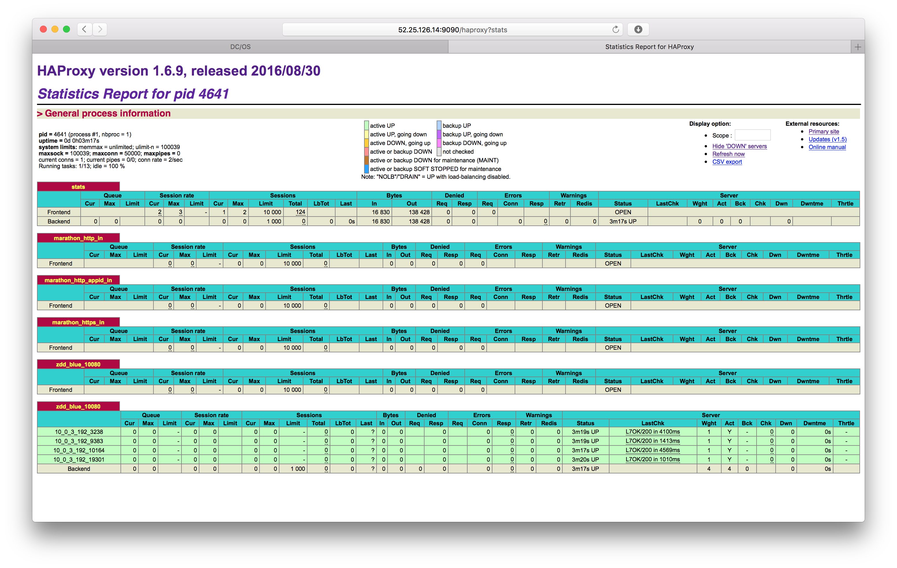

In above HAProxy screen shot we can see the `blue` frontend `zdd_blue_10080` for our service, serving on `52.25.126.14:10099` (with `52.25.126.14` being the IP of my public agent) as well as the `blue`backend `zdd_blue_10080`, corresponding to the four instances DC/OS has launched as requested. To verify the ports we can use Mesos-DNS from within the cluster:

    core@ip-10-0-6-211 ~ $ dig _blue-zdd._tcp.marathon.mesos SRV

    ; <<>> DiG 9.10.2-P4 <<>> _blue-zdd._tcp.marathon.mesos SRV
    ;; global options: +cmd
    ;; Got answer:
    ;; ->>HEADER<<- opcode: QUERY, status: NOERROR, id: 31245
    ;; flags: qr aa rd ra; QUERY: 1, ANSWER: 4, AUTHORITY: 0, ADDITIONAL: 4

    ;; QUESTION SECTION:
    ;_blue-zdd._tcp.marathon.mesos.	IN	SRV

    ;; ANSWER SECTION:
    _blue-zdd._tcp.marathon.mesos. 60 IN	SRV	0 0 19301 blue-zdd-rrf4y-s2.marathon.mesos.
    _blue-zdd._tcp.marathon.mesos. 60 IN	SRV	0 0 9383 blue-zdd-8sqqy-s2.marathon.mesos.
    _blue-zdd._tcp.marathon.mesos. 60 IN	SRV	0 0 3238 blue-zdd-4hzbx-s2.marathon.mesos.
    _blue-zdd._tcp.marathon.mesos. 60 IN	SRV	0 0 10164 blue-zdd-xu4a3-s2.marathon.mesos.

    ;; ADDITIONAL SECTION:
    blue-zdd-xu4a3-s2.marathon.mesos. 60 IN	A	10.0.3.192
    blue-zdd-8sqqy-s2.marathon.mesos. 60 IN	A	10.0.3.192
    blue-zdd-rrf4y-s2.marathon.mesos. 60 IN	A	10.0.3.192
    blue-zdd-4hzbx-s2.marathon.mesos. 60 IN	A	10.0.3.192

    ;; Query time: 1 msec
    ;; SERVER: 198.51.100.1#53(198.51.100.1)
    ;; WHEN: Sat Oct 15 09:15:28 UTC 2016
    ;; MSG SIZE  rcvd: 263

We're now in the position that we can access version `0.9` of `simpleservice` from outside the cluster:

    $ curl http://52.25.126.14:10080/endpoint0
    {"host": "52.25.126.14:10080", "version": "0.9", "result": "all is well"}

Next, we deploy version `1.0` of `simpleservice`, using [green.json](blue-green/green.json). Note that nothing has changed so far in HAProxy (check it out, you'll still see the `blue` frontend and backend), however, we have `green` now available within the cluster:

    core@ip-10-0-6-211 ~ $ dig _green-zdd._tcp.marathon.mesos SRV

    ; <<>> DiG 9.10.2-P4 <<>> _green-zdd._tcp.marathon.mesos SRV
    ;; global options: +cmd
    ;; Got answer:
    ;; ->>HEADER<<- opcode: QUERY, status: NOERROR, id: 32879
    ;; flags: qr aa rd ra; QUERY: 1, ANSWER: 4, AUTHORITY: 0, ADDITIONAL: 4

    ;; QUESTION SECTION:
    ;_green-zdd._tcp.marathon.mesos.	IN	SRV

    ;; ANSWER SECTION:
    _green-zdd._tcp.marathon.mesos.	60 IN	SRV	0 0 30238 green-zdd-re77j-s2.marathon.mesos.
    _green-zdd._tcp.marathon.mesos.	60 IN	SRV	0 0 7077 green-zdd-c8oxq-s2.marathon.mesos.
    _green-zdd._tcp.marathon.mesos.	60 IN	SRV	0 0 3409 green-zdd-657om-s2.marathon.mesos.
    _green-zdd._tcp.marathon.mesos.	60 IN	SRV	0 0 19658 green-zdd-w5mkc-s2.marathon.mesos.

    ;; ADDITIONAL SECTION:
    green-zdd-re77j-s2.marathon.mesos. 60 IN A	10.0.3.192
    green-zdd-657om-s2.marathon.mesos. 60 IN A	10.0.3.192
    green-zdd-c8oxq-s2.marathon.mesos. 60 IN A	10.0.3.192
    green-zdd-w5mkc-s2.marathon.mesos. 60 IN A	10.0.3.192

    ;; Query time: 1 msec
    ;; SERVER: 198.51.100.1#53(198.51.100.1)
    ;; WHEN: Sat Oct 15 09:19:49 UTC 2016
    ;; MSG SIZE  rcvd: 268

So we can test `green` cluster-internally, for example using the following command (executed from the Master, here): 
    
    core@ip-10-0-6-211 ~ $ curl green-zdd.marathon.mesos:7077/endpoint0
    {"host": "green-zdd.marathon.mesos:7077", "version": "1.0", "result": "all is well"}

Now let's say we're satisfied with `green`, all instances are healthy so we update it with below snippet, effectively exposing it via MLB, while simultaneously scaling back `blue` to `0` instances:

    "labels": {
      "HAPROXY_GROUP": "external",
      "HAPROXY_0_PORT": "10080",
      "HAPROXY_0_VHOST": "http://ec2-52-25-126-14.us-west-2.compute.amazonaws.com"
    }

As a result `green` should be available via MLB, so let's check what's going on in HAProxy now:

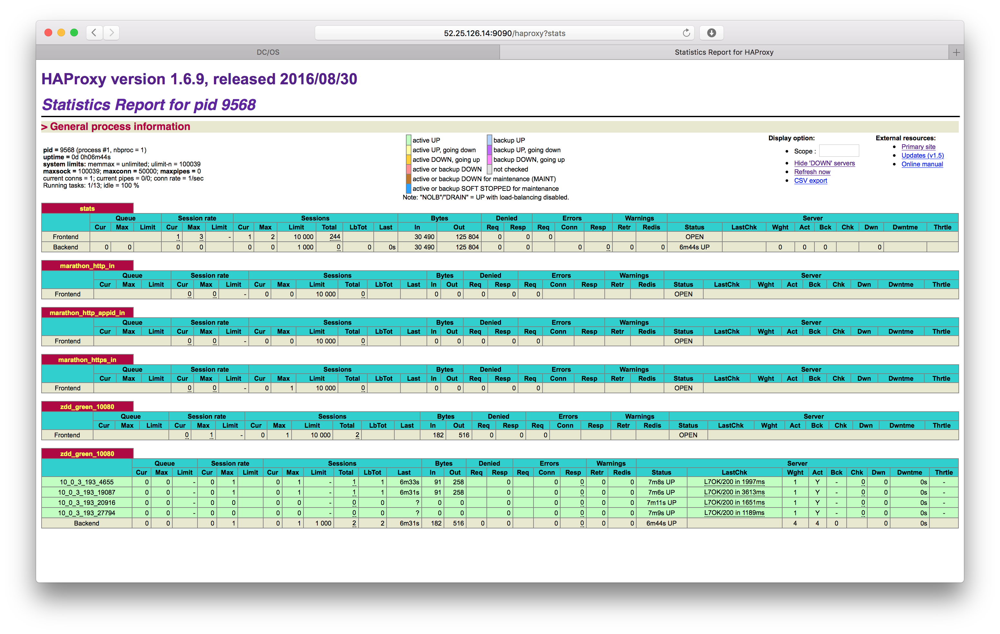

Once we're done scaling down `blue` we want to verify if we can access version `1.0` of `simpleservice` from outside the cluster:

    $ curl http://52.25.126.14:10080/endpoint0
    {"host": "52.25.126.14:10080", "version": "1.0", "result": "all is well"}

And indeed we can. Since the exact mechanics of the deployment orchestration are rather complex, I recommend using [zdd.py](https://github.com/mesosphere/marathon-lb#zero-downtime-deployments) a script that makes respective API calls to the DC/OS System Marathon as well as takes care of gracefully terminating instances using the HAProxy stats endpoint.
